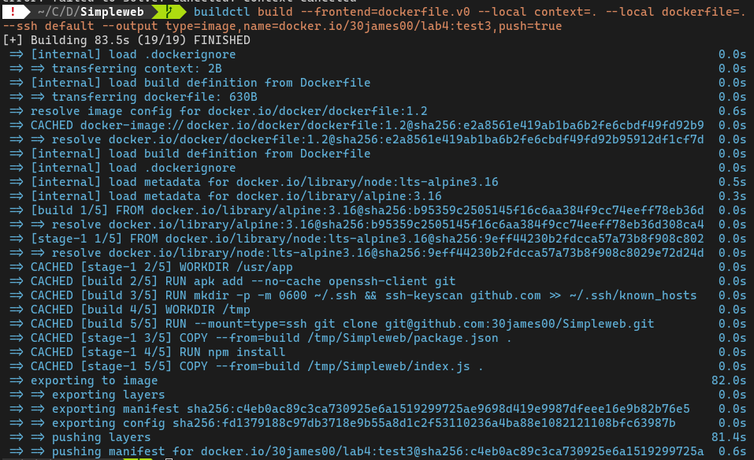

# Test 1

Build image:`buildctl build --frontend=dockerfile.v0 --local context=. --local dockerfile=. --ssh default --output type=image,name=docker.io/30james00/lab4:test3,push=true`

Output:

[Image on DockerHub](https://hub.docker.com/layers/30james00/lab4/test3/images/sha256-c4eb0ac89c3ca730925e6a1519299725ae9698d419e9987dfeee16e9b82b76e5?context=repo)
