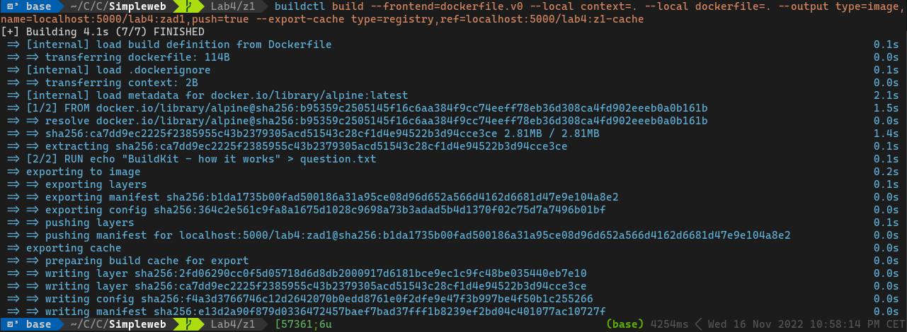
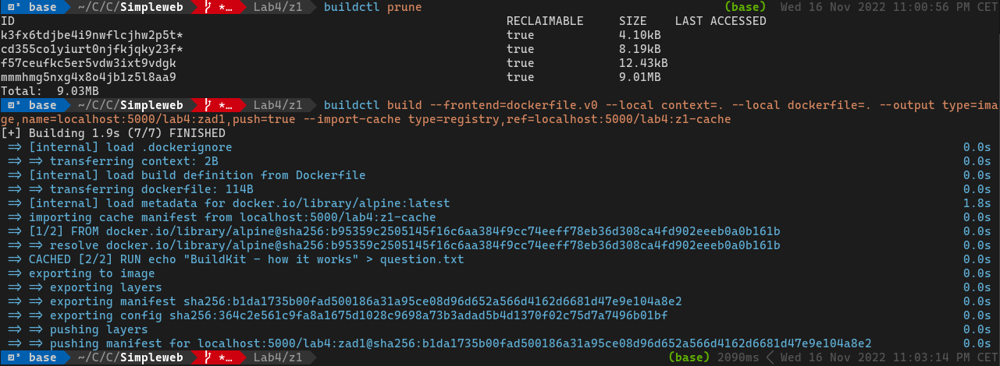
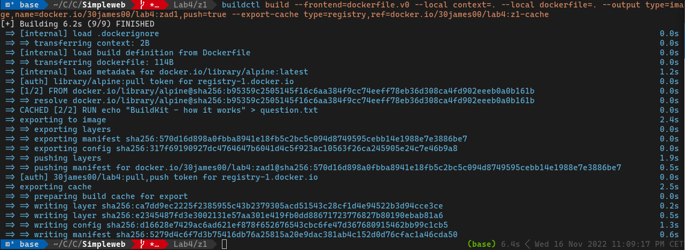
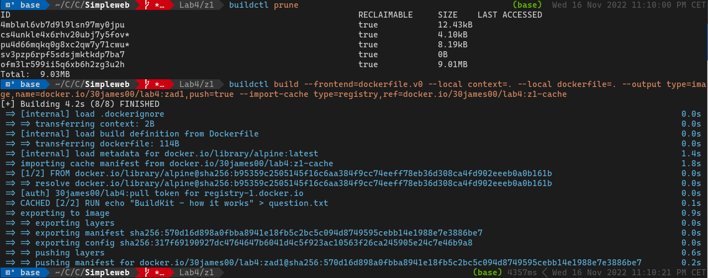

# Z1

Run reposiory: `docker run -d -p 5000:5000 --restart=always --name registry registry:2`  
Build image: `buildctl build --frontend=dockerfile.v0 --local context=. --local dockerfile=. --output type=image,name=localhost:5000/lab4:zad1,push=true --export-cache type=registry,ref=localhost:5000/lab4:z1-cache`

Clear BuildKit cache: `buildctl prune`  
Build image with imported cache: `buildctl build --frontend=dockerfile.v0 --local context=. --local dockerfile=. --output type=image,name=localhost:5000/lab4:zad1,push=true --import-cache type=registry,ref=localhost:5000/lab4:z1-cache`

## For DockerHub repository

Build image: `buildctl build --frontend=dockerfile.v0 --local context=. --local dockerfile=. --output type=image,name=localhost:5000/lab4:zad1,push=true --export-cache type=registry,ref=localhost:5000/lab4:z1-cache`

Build image with imported cache: `buildctl build --frontend=dockerfile.v0 --local context=. --local dockerfile=. --output type=image,name=localhost:5000/lab4:zad1,push=true --import-cache type=registry,ref=localhost:5000/lab4:z1-cache`

[Image on DockerHub](https://hub.docker.com/layers/30james00/lab4/zad1/images/sha256-570d16d898a0fbba8941e18fb5c2bc5c094d8749595cebb14e1988e7e3886be7?context=repo)  
[Cache on DockerHub](https://hub.docker.com/layers/30james00/lab4/z1-cache/images/sha256-5279d4c6f7d3b75416db76a25815a20e9dac381ab4c152d0d76cfac1a46cda50?context=repo)