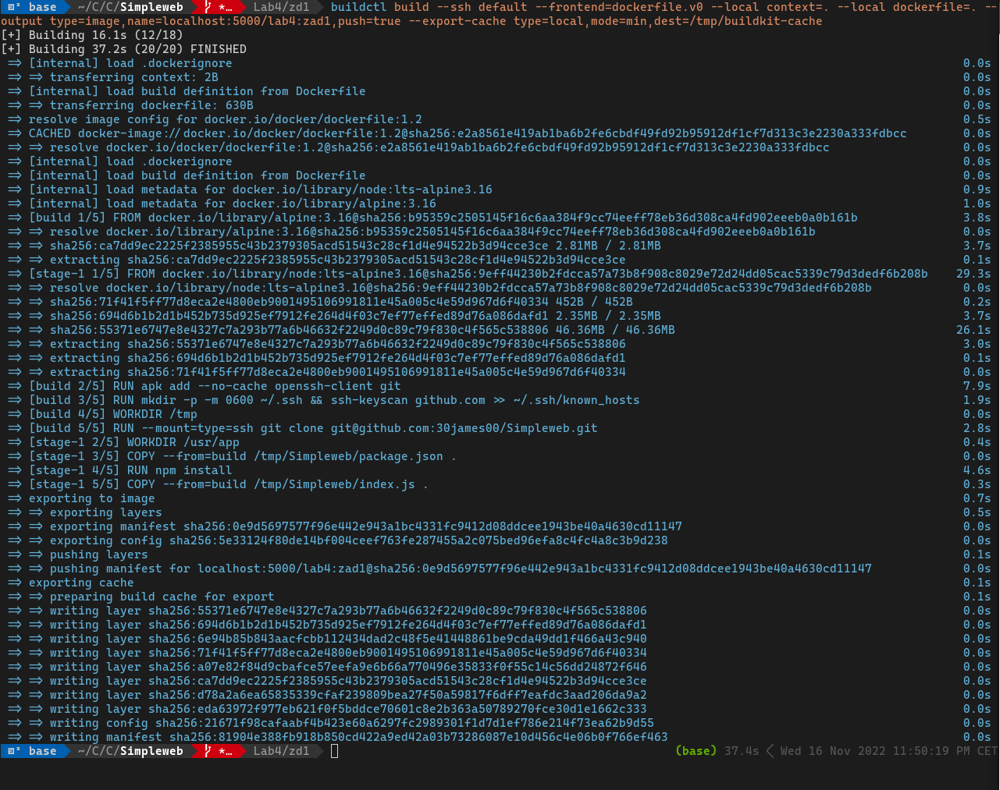
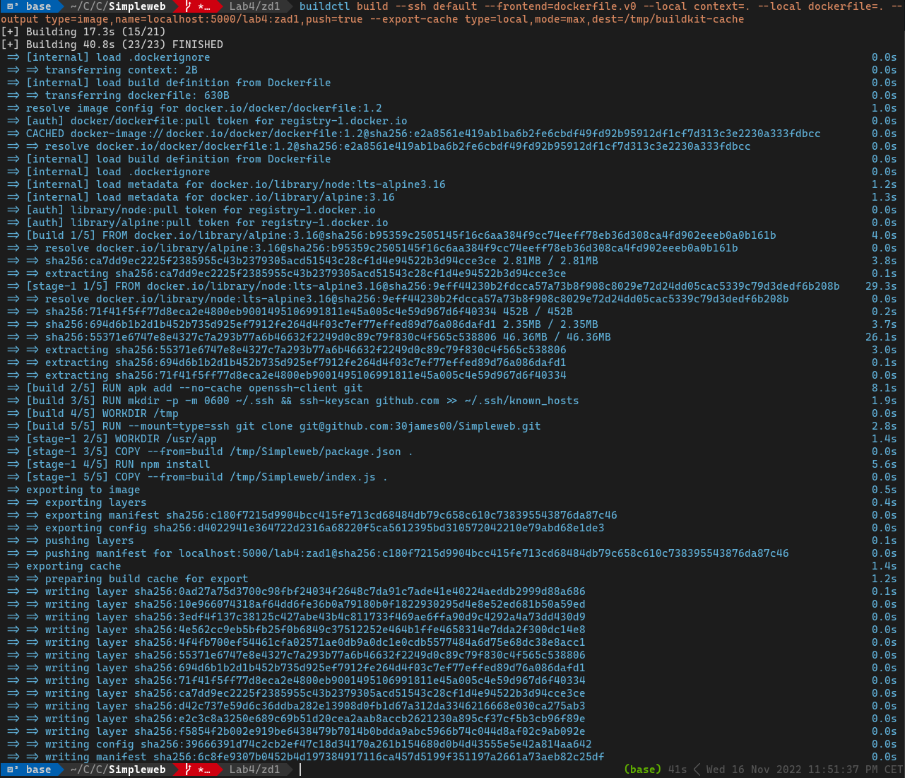
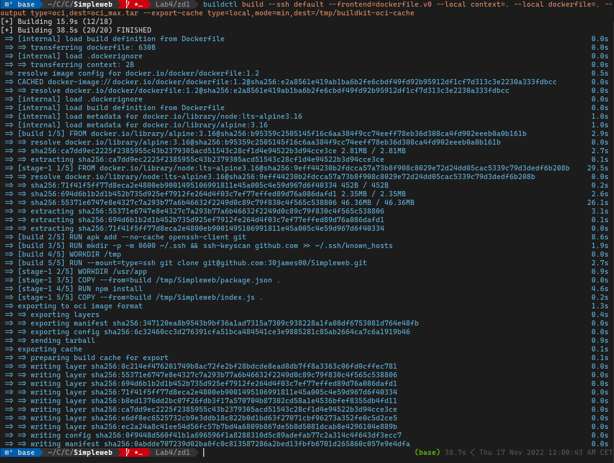
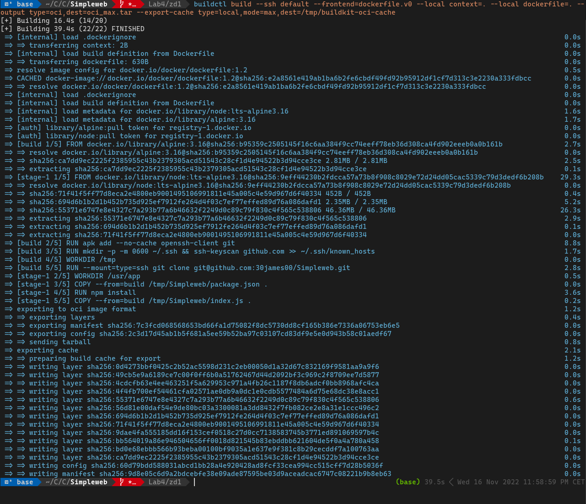
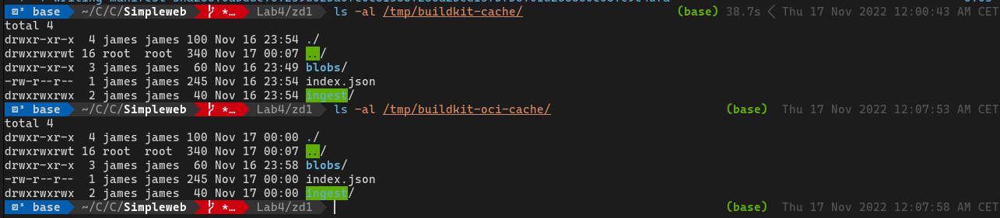

# ZD1

## For Docker image with min cache
Build: `buildctl build --ssh default --frontend=dockerfile.v0 --local context=. --local dockerfile=. --output type=image,name=localhost:5000/lab4:zad1,push=true --export-cache type=local,mode=max,dest=/tmp/buildkit-cache`

## For Docker image with max cache
Build: `buildctl build --ssh default --frontend=dockerfile.v0 --local context=. --local dockerfile=. --output type=image,name=localhost:5000/lab4:zad1,push=true --export-cache type=local,mode=max,dest=/tmp/buildkit-cache`

## For OCI image with min cache
Build: `buildctl build --ssh default --frontend=dockerfile.v0 --local context=. --local dockerfile=. --output type=oci,dest=oci_min.tar --export-cache type=local,mode=min,dest=/tmp/buildkit-oci-cache`

## For OCI image with max cache
Build: `buildctl build --ssh default --frontend=dockerfile.v0 --local context=. --local dockerfile=. --output type=oci,dest=oci_max.tar --export-cache type=local,mode=max,dest=/tmp/buildkit-oci-cache`

Cache folders structure:

As we can see on screenshots, `min` cache mode writes 8 layers to cache and `max` mode writes 12. That's because `min` only export layers for the resulting image. In contrast `max` exports all layers.

There is no difference between cache for Docker and OCI output. Structure and of cache folders is the same. BuildKit docs mentions that:
>The directory layout conforms to OCI Image Spec v1.0. 

Jak możemy zauważyć na zrzutach ekranu, tryb cache `min` zapisuje 8 warstw, a `max` 12 warstw. Spowodowane jest to tym, że `min` zapisuje tylko warstwy wynikowego obrazu, a `max` wszystkie warstwy.

Nie ma różnicy pomiędzy pomiędzy cache w zależnści czy wynikiem jest obraz Docker czy OCI. Struktura folderów jest taka sama. Dokumentacja BuildKit wspomina:
>The directory layout conforms to OCI Image Spec v1.0.