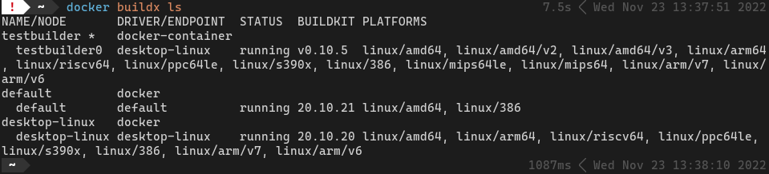
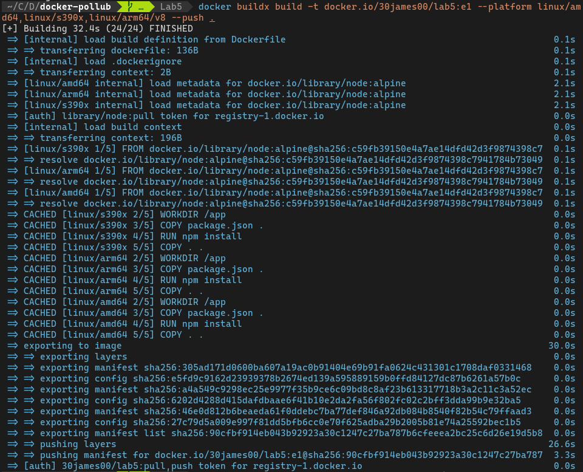
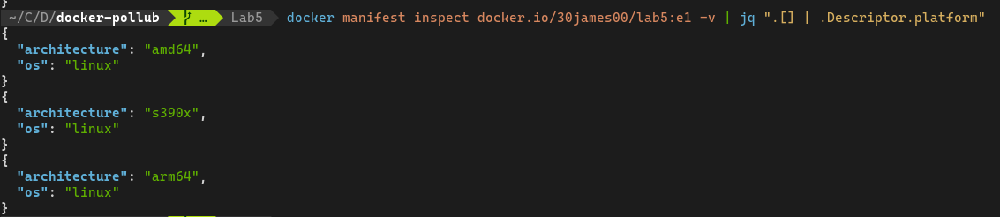
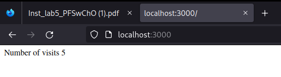
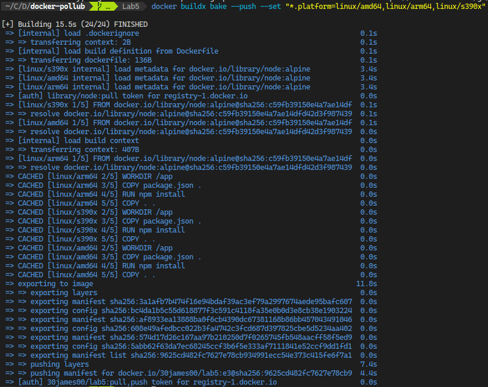

# Laboratorium 5

## Etap 1

1. Należy sprawdzi dla jakich platform sprzętowych jest dostępny obraz bazowy z dostarczanego pliku Dockerfile  

   node.js: `linux/amd64`, `linux/arm/v6`, `linux/arm/v7`, `linux/arm64/v8`, `linux/ppc64le`, `linux/s390x`  

   redis: `linux/amd64`, `linux/arm/v6`, `linux/arm/v7`, `linux/arm64/v8`, `linux/386`, `linux/ppc64le`, `linux/s390x`
2. Wykorzystując buildx, sterownik docker-container oraz QEMU należy zbudować obraz dla trzech wybranych architektur sprzętowych i przesłać go do swojego konta na DockerHub.

- Zadanie wykonywane przy użyciu środowiska Docker Desktop -> nie ma konieczności instalacji `qemu`

- Stan wyboru sterownika:  
  
  

- Budowanie obrazu dla 3 platform dla których istnieją obrazy `node` i `redis`:

   `docker buildx build -t docker.io/30james00/lab5:e1 --platform linux/amd64,linux/s390x,linux/arm64/v8 --push .`

   

3. Sprawdzić czy zbudowany obraz wspiera wybrane architektury sprzętowe  
   `docker manifest inspect docker.io/30james00/lab5:e1 -v | jq ".[] | .Descriptor.platform"`

   

   Wynik uruchomienia kontenera ze zbudowanego obrazu (brak redis)

   

## Etap 2

1. Zbudować plik docker-compose.yml, który deklaruje użycie dwóch serwisów, redis oraz app gdzie app oznacza kontener BUDOWANY na bazie dostarczonego pliku Dockerfile.  
   [Docker Compose](./docker-compose.yml)
2. Cała usługa ma by dostępna na lokalnym hoście, na porcie 3000.

```
    ports:
      - '3000:3000'
```

3. Należy uruchomić i zaprezentować działanie utworzonej aplikacji  
   
   Do uruchomienia: `docker compose up`
   
   

## Etap 3

1. Jak należy uzupełnić polecenie docker compose by możliwe było przegotowanie aplikacji na inną platformę sprzętową niż architektura wykorzystywanego hosta (komputera)  
   
   Do budowy użyto: `docker buildx bake --push --set "*.platform=linux/amd64,linux/arm64,linux/s390x"`  
   
   
