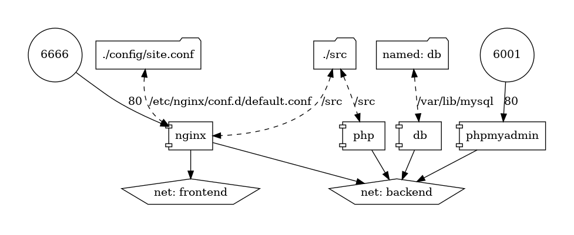

# Programowanie w chmurze obliczeniowej
## Zadanie 2: Budowa środowiska do rozwoju i uruchamiania aplikacji webowych
Folder `config` zawiera pliki konfiguracyjne dla nginx  
Folder `src` zawiera stronę z phpinfo()  

### Uruchomienie stacku i phpMyAdmin
`docker compose up -d`

Output (wcześniej budowane):
```
[+] Running 4/4
 ⠿ Container zad02-db-1          Started                                                                                        0.8s
 ⠿ Container zad02-nginx-1       Started                                                                                        0.8s
 ⠿ Container zad02-php-1         Started                                                                                        0.7s
 ⠿ Container zad02-phpmyadmin-1  Running                                                                                        0.0s
```
### Tworzenie testowej bazy
`docker exec zad02-db-1 mysql --execute="CREATE DATABASE test" --user=root --password=<password>`

Baza widoczna w phpMyAdmin:  


### Generowanie pliku ilustrującego strukturę projektu
`docker container run --rm -it --name mgraph -v $(pwd):/input pmsipilot/docker-compose-viz render -m image docker-compose.yaml`   

